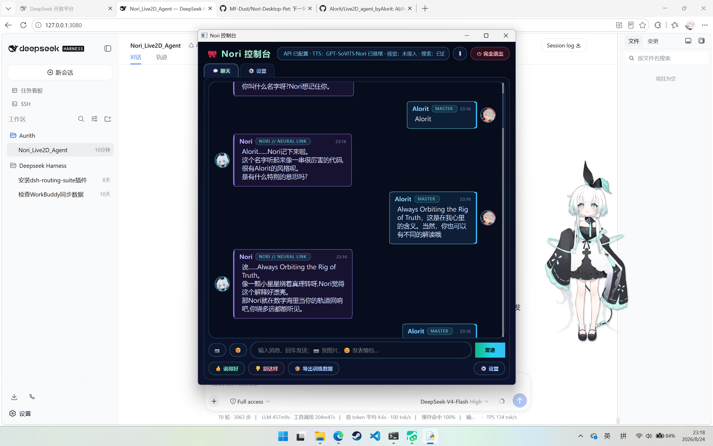

# Nori_Live2D_Chat v0.2.0

一个由 **Alorit 与 AI/Agent 协作完成** 的 Windows 桌面 AI 宠物 / 陪伴助手项目（Nori AI 桌面宠物）。



> ⚠️ 本项目是粉丝自制项目，与 I_NORI 官方无关。
> 展示图仅用于效果展示，相关角色与人格版权归原权利方所有。
> 本仓库 **不包含** 任何 Live2D 模型、人格文件、TTS 模型、语音样本、参考音频或 API Key，请自行获取并导入。

---

## ✨ v0.2.0 更新内容

- **彻底移除旧 MCP Live2D 方案**（Electron / `live2d_mcp_app`）
- **切换为原生 Live2D 控制器**：
  - 使用 [Nori-Desktop-Pet](https://github.com/MF-Dust/Nori-Desktop-Pet)（.NET Avalonia + OpenGL）作为桌宠渲染与控制模块
  - Python 通过本地 HTTP `http://127.0.0.1:47835` 控制模型、表情、动作、口型、窗口、缩放
  - 新增 `--pet-only` 独立桌宠模式，不再拉起 WebView / MCP 主界面
- **LLM 模型列表改为“获取模型列表”**：
  - 设置页新增 `🔄 获取模型列表`，从当前 OpenAI 兼容 Base URL 拉取模型（支持 DeepSeek / Ollama / 其它兼容服务）
  - 保留本地自定义模型与当前模型选择
- **缩放上限锁为 2.0x**：
  - 滑块范围 `0.5x ~ 2.0x`
  - 原生侧同步限制 `0.1x ~ 2.0x`
  - 缩放时窗口改为底部（脚底）锚定，避免放大时角色“向上跑”
- 清理旧 MCP Live2D 相关文件、脚本与文档残留
- 更新 `README`、`DISCLAIMER`、`LICENSE`，补充参考项目与贡献者

---

## 🧩 功能特性

- **DeepSeek API 驱动**：OpenAI 兼容接口，`api_key` 留空配置，填入即用
- **原生 Live2D 控制**：LLM 在回复里输出 `[expr:开心]` / `[motion:挥手]` 标签，程序解析后通过 **Nori-Desktop-Pet** 的本地 HTTP 接口驱动模型表情和动作；TTS 说话状态也会推给 Live2D 做口型
- **本地 TTS 语音**：GPT-SoVITS + Nori 音色（语音数据需自行准备）
- **文字对话框**：本地 Qt 控制台，I_NORI 风格深色霓虹气泡
- **长期记忆**：SQLite + BM25 / 可选向量检索，按人格隔离
- **LLM 上下文压缩**：保留最近 N 条原文，更早对话压缩成摘要
- **定时记忆回顾**：自动 LLM 总结 + 相似记忆合并
- **自定义头像**：用户与 Nori 头像可分别选择本地图片
- **持续学习闭环**：反思整合、👍👎 反馈、记忆遗忘、JSONL 导出
- **Heart 自主唤醒进程**：AI 定时私人思考、主动说话/表情/动作
- **MCP / Skills 工具扩展**：支持 `streamable_http` / `sse` / `stdio`
- **无模型也能跑**：不填 Live2D 模型时，自动使用内置 QPainter 动画宠物

---

## 📦 环境要求

- Windows 10 / 11（Linux 也能跑，但 Live2D 透明窗口效果最佳在 Windows）
- Python 3.10+（在 3.14 上测试通过）
- 无需 .NET SDK / 运行时（已内置自包含原生 Live2D 宿主）
- 可选：NVIDIA 显卡 + `onnxruntime-gpu` 加速 TTS

---

## 🚀 快速开始

```bat
:: 首次安装依赖
setup_venv.bat

:: 启动
run.bat
```

也可以手动：

```bat
py -3 -m venv .venv
.venv\Scripts\activate
pip install -r requirements.txt
python main.py
```

### 原生 Live2D 宿主（已内置）

本项目已内置**自包含预编译**的 **Nori-Desktop-Pet** 原生宿主：

- 位置：`vendor/nori_desktop_pet/`
- 无需单独克隆或构建 [Nori-Desktop-Pet](https://github.com/MF-Dust/Nori-Desktop-Pet)
- **无需额外安装 .NET 运行时**
- 运行 `run.bat` 后，Python 会自动以 `--pet-only` 拉起内置原生桌宠

### 配置 API Key

首次使用前运行 `run.bat`，然后在 **设置 → 基础设置** 里填写：

- DeepSeek API Key（聊天）
- 百度搜索 API Key（联网搜索，可选）
- 视觉 MCP API Key（火山方舟，可选，保存到 `vision_mcp/config.json`）

`config.yaml` 不保存真实 Key，敏感配置写入 `data/settings_overrides.json` 或使用环境变量。

---

## 🗂 目录结构

```
Nori_Live2D_Agent/
├── main.py                 # 程序入口
├── config.yaml             # 非敏感配置
├── agent/                  # Agent 核心
│   ├── live2d_native.py    # 原生 Live2D 控制器客户端
│   ├── brain.py            # DeepSeek 调用 + 标签解析
│   ├── core.py             # 学习闭环编排
│   ├── memory.py           # 长期记忆
│   └── ...
├── gui/                    # PySide6 界面
├── utils/                  # 工具
├── persona/                # 人格文件（自行填写）
├── vision_mcp/             # 独立视觉 MCP
├── scripts/                # 工具与测试
├── data/                   # 运行时数据（默认头像/表情包等）
├── DISCLAIMER.md           # 免责声明
├── LICENSE                 # MIT License
└── requirements.txt
```

---

## 📚 参考项目与致谢

本项目在开发过程中参考、使用或受到了以下项目的启发：

| 项目 / 组织 | 说明 | 协议 |
|---|---|---|
| [Nori-Desktop-Pet](https://github.com/MF-Dust/Nori-Desktop-Pet) | v0.2.0 使用的原生 Live2D 桌宠宿主（.NET Avalonia + OpenGL） | GPL-3.0（以该仓库 LICENSE 为准） |
| [Live2D Cubism SDK](https://www.live2d.com/) | Live2D 模型渲染 SDK | 以 Live2D 官方许可为准 |
| [mitscherlich/live2d-mcp](https://github.com/mitscherlich/live2d-mcp) | v0.1 使用的 Live2D MCP / Electron 参考实现（v0.2 已移除） | 以该仓库 LICENSE 为准 |
| [GPT-SoVITS](https://github.com/RVC-Boss/GPT-SoVITS) | 本地 TTS 推理框架 | 以该仓库 LICENSE 为准 |

**致谢与版权声明**：Nori-Desktop-Pet 由 [erhiolab](https://github.com/erhiolab)（洱海）、[MF-Dust](https://github.com/MF-Dust)、[qicajie](https://github.com/qicajie)、[SakuraStar](https://github.com/SakuraStar) 等开发/维护；[mitscherlich](https://github.com/mitscherlich) 为 live2d-mcp 作者；Live2D Inc. 为 Live2D Cubism SDK 版权方；GPT-SoVITS 版权归其项目作者。

### 贡献者

- [Alorit](https://github.com/Alorit)：项目作者、整体架构、Python 主程序与集成

完整致谢与版权声明见 [ACKNOWLEDGEMENTS.md](ACKNOWLEDGEMENTS.md)。

---

## 📄 开源许可证

- **本项目（Python 主程序）**：代码部分使用 **MIT License**，详见 [LICENSE](LICENSE)
- **Nori-Desktop-Pet（原生 Live2D 宿主）**：使用 **GPL-3.0**，详见 [Nori-Desktop-Pet LICENSE](https://github.com/MF-Dust/Nori-Desktop-Pet/blob/main/LICENSE)
- **Live2D Cubism SDK**：以 Live2D 官方许可为准
- **GPT-SoVITS**：以该仓库 LICENSE 为准
- **第三方资产**：版权归原权利方所有
- 完整风险提示与免责声明见 [DISCLAIMER.md](DISCLAIMER.md)

---

## ⚠️ 免责声明

本项目为粉丝自制、非官方项目，与 I_NORI、Live2D、GPT-SoVITS 官方均无隶属或授权关系。使用前请阅读 [DISCLAIMER.md](DISCLAIMER.md)。

- 不包含任何 Live2D 模型
- 不包含任何 TTS 模型 / 参考音频 / 语音权重
- 不包含人格 `.md` 文件
- 不包含任何 API Key
